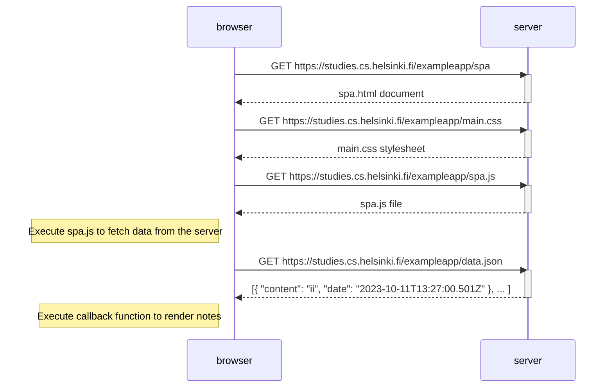

# Sequence Diagram Showing Events of a Single Application Page
> @Author - JimmyKurui

```mermaid
    sequenceDiagram
    participant browser
    participant server

    browser->>server: GET https://studies.cs.helsinki.fi/exampleapp/spa
    activate server
    server-->>browser: spa.html document
    deactivate server

    browser->>server: GET https://studies.cs.helsinki.fi/exampleapp/main.css
    activate server
    server-->>browser: main.css stylesheet
    deactivate server

    browser->>server: GET https://studies.cs.helsinki.fi/exampleapp/spa.js
    activate server
    server-->>browser: spa.js file
    deactivate server

    Note left of browser: Execute spa.js to fetch data from the server

    browser->>server: GET https://studies.cs.helsinki.fi/exampleapp/data.json
    activate server
    server-->>browser: [{ "content": "ii", "date": "2023-10-11T13:27:00.501Z" }, ... ]
    deactivate server

    Note left of browser: Execute callback function to render notes
```