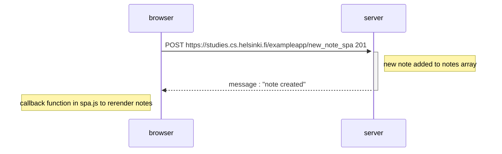

# Sequence Diagram Showing Events of Creating a New Note for Single Page Application
> Author - JimmyKurui

```mermaid
    sequenceDiagram
    participant browser
    participant server

    browser->>+server: POST https://studies.cs.helsinki.fi/exampleapp/new_note_spa 201
    activate server
    Note right of server: new note added to notes array
    server-->>browser: message : "note created" 
    deactivate server
    
    Note left of browser: callback function in spa.js to rerender notes
```
