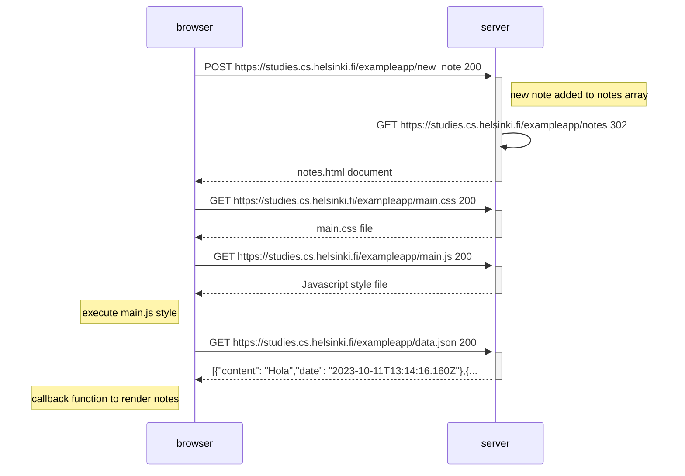

# Sequence Diagram Showing Events of Creating a New Note 
> JimmyKurui

```mermaid
    sequenceDiagram
    participant browser
    participant server

    browser->>+server: POST https://studies.cs.helsinki.fi/exampleapp/new_note 200
    activate server
    Note right of server: new note added to notes array
    server->>server: GET https://studies.cs.helsinki.fi/exampleapp/notes 302
    server-->>browser: notes.html document
    deactivate server

    browser->>server: GET https://studies.cs.helsinki.fi/exampleapp/main.css 200
    activate server
    server-->>browser: main.css file 
    deactivate server

    browser->>server: GET https://studies.cs.helsinki.fi/exampleapp/main.js 200
    activate server
    server-->>browser: Javascript style file 
    deactivate server

    Note left of browser: execute main.js style
    browser->>server: GET https://studies.cs.helsinki.fi/exampleapp/data.json 200
    activate server
    server-->>browser: [{"content": "Hola","date": "2023-10-11T13:14:16.160Z"},{... 
    deactivate server
    
    Note left of browser: callback function to render notes
```